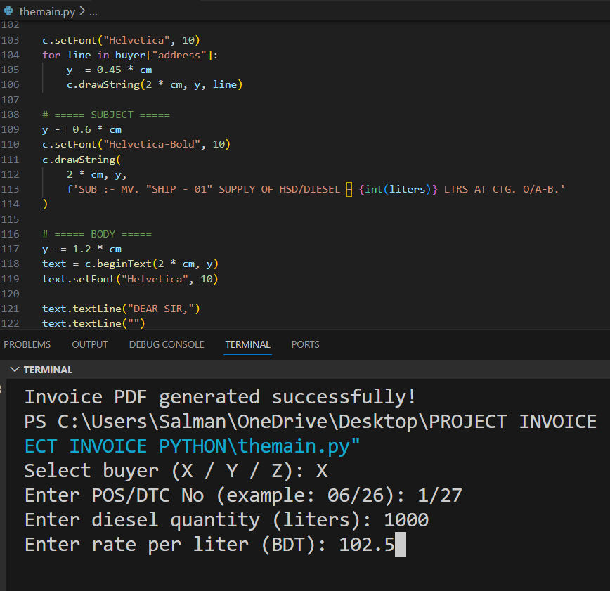
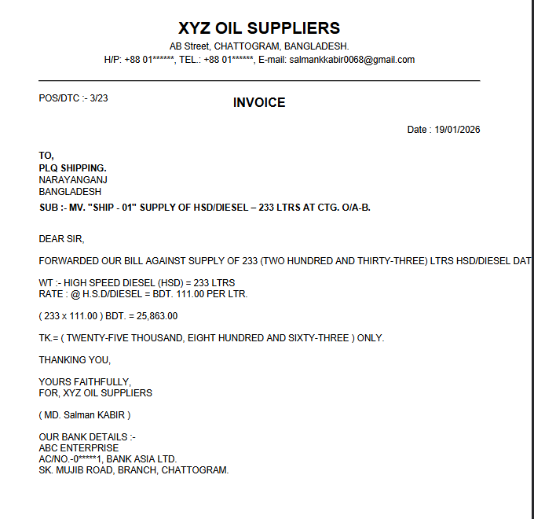

# Invoice-pdf-generator# Python Invoice Generator (PDF)

A simple Python program that generates professional PDF invoices using the ReportLab library.

## Features
- Buyer selection (X / Y / Z)
- Manual POS/DTC number input
- Diesel quantity and rate input
- Automatic total calculation
- Amount converted into words
- PDF invoice output
- Invoices saved in a separate folder

## Requirements
- Python 3
- reportlab
- num2words

## Installation
```bash
pip install reportlab num2words

## Demo

### Running the program in terminal:


### Generated invoice PDF sample:


